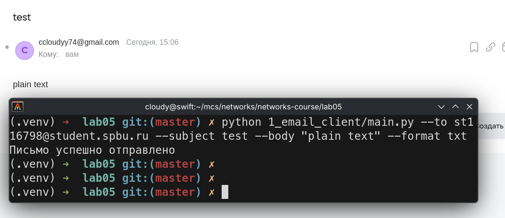
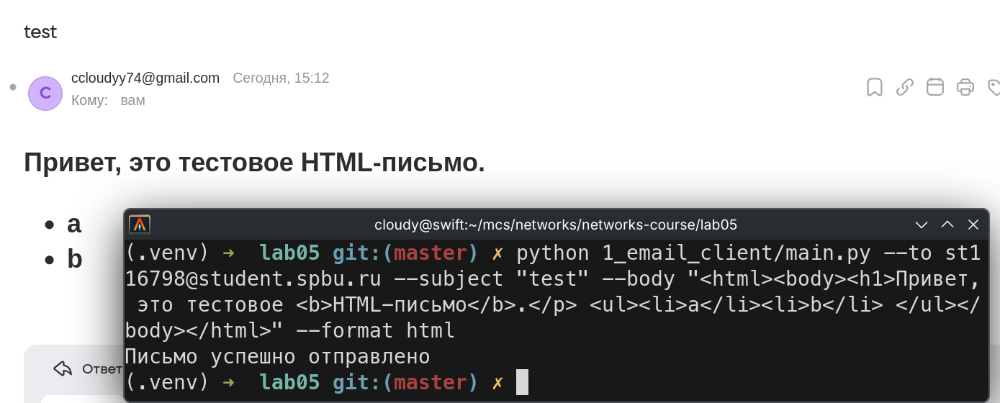
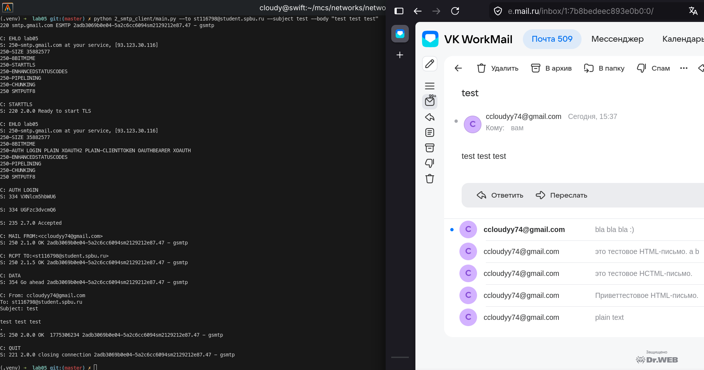
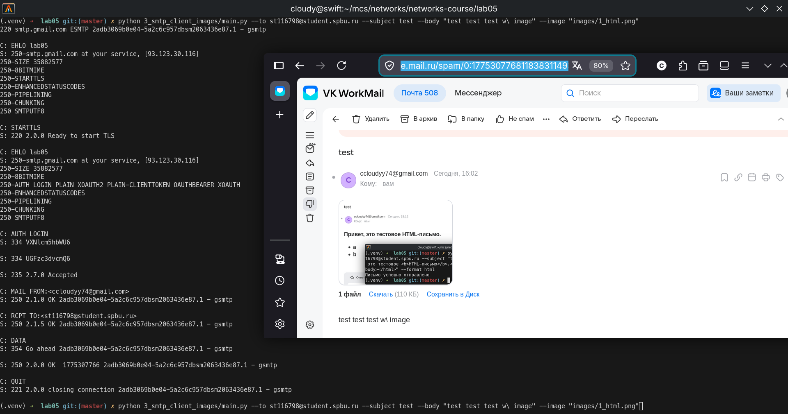
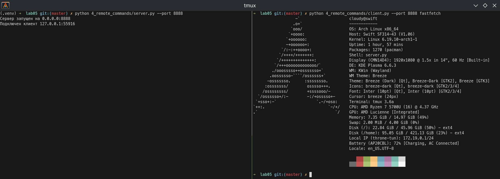
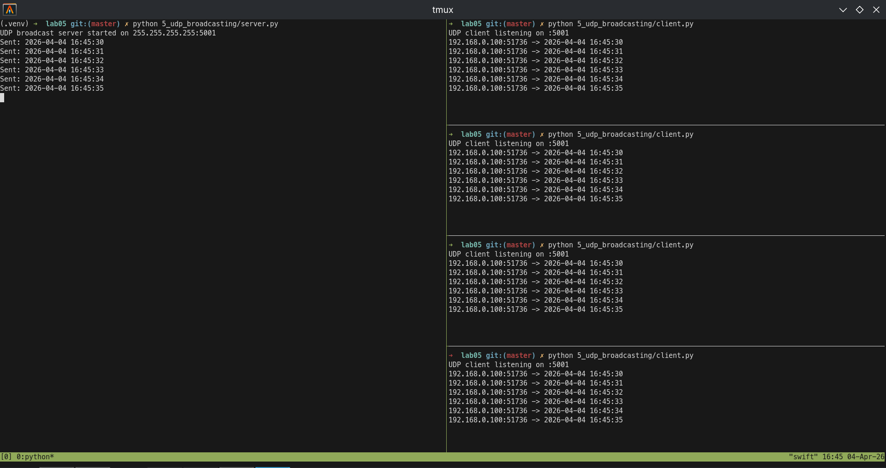

# Практика 5. Прикладной уровень

## Программирование сокетов.

### A. Почта и SMTP (7 баллов)

### 1. Почтовый клиент (2 балла)
Напишите программу для отправки электронной почты получателю, адрес
которого задается параметром. Адрес отправителя может быть постоянным. Программа
должна поддерживать два формата сообщений: **txt** и **html**. Используйте готовые
библиотеки для работы с почтой, т.е. в этом задании **не** предполагается общение с smtp
сервером через сокеты напрямую.

Приложите скриншоты полученных сообщений (для обоих форматов).

#### Демонстрация работы

### 2. SMTP-клиент (3 балла)
Разработайте простой почтовый клиент, который отправляет текстовые сообщения
электронной почты произвольному получателю. Программа должна соединиться с
почтовым сервером, используя протокол SMTP, и передать ему сообщение.
Не используйте встроенные методы для отправки почты, которые есть в большинстве
современных платформ. Вместо этого реализуйте свое решение на сокетах с передачей
сообщений почтовому серверу.

Сделайте скриншоты полученных сообщений.

#### Демонстрация работы

### 3. SMTP-клиент: бинарные данные (2 балла)
Модифицируйте ваш SMTP-клиент из предыдущего задания так, чтобы теперь он мог
отправлять письма с изображениями (бинарными данными).

Сделайте скриншот, подтверждающий получение почтового сообщения с картинкой.

#### Демонстрация работы

---

_Многие почтовые серверы используют ssl, что может вызвать трудности при работе с ними из
ваших приложений. Можете использовать для тестов smtp сервер СПбГУ: mail.spbu.ru, 25_

### Б. Удаленный запуск команд (3 балла)
Напишите программу для запуска команд (или приложений) на удаленном хосте с помощью TCP сокетов.

Например, вы можете с клиента дать команду серверу запустить приложение Калькулятор или
Paint (на стороне сервера). Или запустить консольное приложение/утилиту с указанными
параметрами. Однако запущенное приложение **должно** выводить какую-либо информацию на
консоль или передавать свой статус после запуска, который должен быть отправлен обратно
клиенту. Продемонстрируйте работу вашей программы, приложив скриншот.

Например, удаленно запускается команда `ping yandex.ru`. Результат этой команды (запущенной на
сервере) отправляется обратно клиенту.

#### Демонстрация работы

### В. Широковещательная рассылка через UDP (2 балла)
Реализуйте сервер (веб-службу) и клиента с использованием интерфейса Socket API, которая:
- работает по протоколу UDP
- каждую секунду рассылает широковещательно всем клиентам свое текущее время
- клиент службы выводит на консоль сообщаемое ему время

#### Демонстрация работы

## Задачи

### Задача 1 (2 балла)
Рассмотрим короткую, $10$-метровую линию связи, по которой отправитель может передавать
данные со скоростью $150$ бит/с в обоих направлениях. Предположим, что пакеты, содержащие
данные, имеют размер $100000$ бит, а пакеты, содержащие только управляющую информацию
(например, флаг подтверждения или информацию рукопожатия) – $200$ бит. Предположим, что у
нас $10$ параллельных соединений, и каждому предоставлено $1/10$ полосы пропускания канала
связи. Также допустим, что используется протокол HTTP, и предположим, что каждый
загруженный объект имеет размер $100$ Кбит, и что исходный объект содержит $10$ ссылок на другие
объекты того же отправителя. Будем считать, что скорость распространения сигнала равна
скорости света ($300 \cdot 10^6$ м/с).
1. Вычислите общее время, необходимое для получения всех объектов при параллельных
непостоянных HTTP-соединениях
2. Вычислите общее время для постоянных HTTP-соединений. Ожидается ли существенное
преимущество по сравнению со случаем непостоянного соединения?

#### Решение
Сначала оценим задержки:

- время распространения: $t_{prop} = \dfrac{10}{3 \cdot 10^8} \approx 3.3 \cdot 10^{-8}$ с
- передача управляющего пакета: $t_{ctrl} = \dfrac{200}{150} \approx 1.33$ с
- передача объекта $100$ Кбит: $t_{obj} = \dfrac{100000}{150} \approx 666.67$ с

Базовый HTML-объект сначала получаем по одному соединению:

$T_0 \approx \frac{3 \cdot 200 + 100000}{150} \approx 670.67 \text{ с}$.

Здесь учтены `SYN`, `SYN+ACK`, запрос `GET` и передача самого объекта.

1. Для $10$ параллельных непостоянных соединений каждое получает только $15$ бит/с. Тогда для одного встроенного объекта:

$T_1 \approx \frac{3 \cdot 200 + 100000}{15} \approx 6706.67 \text{ с}$.

Так как эти $10$ объектов качаются параллельно, общее время:

$T_{np} \approx T_0 + T_1 \approx 670.67 + 6706.67 = 7377.34 \text{ с}$.

2. Для постоянного HTTP-соединения (без повторного рукопожатия) после получения базовой страницы остаётся ещё $10$ запросов по тому же соединению:

$T_p \approx T_0 + 10 \cdot \frac{200 + 100000}{150} = 670.67 + 6680 = 7350.67 \text{ с}$.

Существенного преимущества нет.

### Задача 2 (3 балла)
Рассмотрим раздачу файла размером $F = 15$ Гбит $N$ пирам. Сервер имеет скорость отдачи $u_s = 30$
Мбит/с, а каждый узел имеет скорость загрузки $d_i = 2$ Мбит/с и скорость отдачи $u$. Для $N = 10$, $100$
и $1000$ и для $u = 300$ Кбит/с, $700$ Кбит/с и $2$ Мбит/с подготовьте график минимального времени
раздачи для всех сочетаний $N$ и $u$ для вариантов клиент-серверной и одноранговой раздачи.

#### Решение

$D_{CS} = \max\left(\frac{NF}{u_s}, \frac{F}{d_{min}}\right)$, $D_{P2P} = \max\left(\frac{F}{u_s}, \frac{F}{d_{min}}, \frac{NF}{u_s + N u}\right)$.

| $N$ | $u$ | $D_{CS}$, c | $D_{P2P}$, c |
|---|---:|---:|---:|
| 10 | 300 Кбит/с | 7500 | 7500 |
| 10 | 700 Кбит/с | 7500 | 7500 |
| 10 | 2 Мбит/с | 7500 | 7500 |
| 100 | 300 Кбит/с | 50000 | 25000 |
| 100 | 700 Кбит/с | 50000 | 15000 |
| 100 | 2 Мбит/с | 50000 | 7500 |
| 1000 | 300 Кбит/с | 500000 | 45454.55 |
| 1000 | 700 Кбит/с | 500000 | 20547.95 |
| 1000 | 2 Мбит/с | 500000 | 7500 |

### Задача 3 (3 балла)
Рассмотрим клиент-серверную раздачу файла размером $F$ бит $N$ пирам, при которой сервер
способен отдавать одновременно данные множеству пиров – каждому с различной скоростью,
но общая скорость отдачи при этом не превышает значения $u_s$. Схема раздачи непрерывная.
1. Предположим, что $\dfrac{u_s}{N} \le d_{min}$.
   При какой схеме общее время раздачи будет составлять $\dfrac{N F}{u_s}$?
2. Предположим, что $\dfrac{u_s}{N} \ge d_{min}$. 
   При какой схеме общее время раздачи будет составлять  $\dfrac{F}{d_{min}}$?
3. Докажите, что минимальное время раздачи описывается формулой $\max\left(\dfrac{N F}{u_s}, \dfrac{F}{d_{min}}\right)$?

#### Решение
1. Если $\dfrac{u_s}{N} \le d_{min}$, достаточно раздавать всем пирам одинаковую скорость $r_i = \frac{u_s}{N}$.

Тогда каждый получит файл за время $T = \frac{F}{r_i} = \frac{F}{u_s / N} = \frac{NF}{u_s}$.

2. Если $\dfrac{u_s}{N} \ge d_{min}$, можно каждому пиру выделить скорость $r_i = d_{min}$.

Это допустимо, потому что $N d_{min} \le u_s$ и у каждого клиента $d_i \ge d_{min}$. Тогда все завершат загрузку за $T = \frac{F}{d_{min}}$.

3. Почему минимум равен $\max\left(\frac{NF}{u_s}, \frac{F}{d_{min}}\right)$.

Нижние оценки:

- сервер должен суммарно отдать $NF$ бит, значит $T \ge \dfrac{NF}{u_s}$
- самый медленный клиент не может скачать файл быстрее чем за $\dfrac{F}{d_{min}}$, значит $T \ge \dfrac{F}{d_{min}}$

Следовательно: $T \ge \max\left(\frac{NF}{u_s}, \frac{F}{d_{min}}\right)$.

И эта граница достигается схемами из пунктов 1 и 2, значит она и есть минимальное время раздачи.
